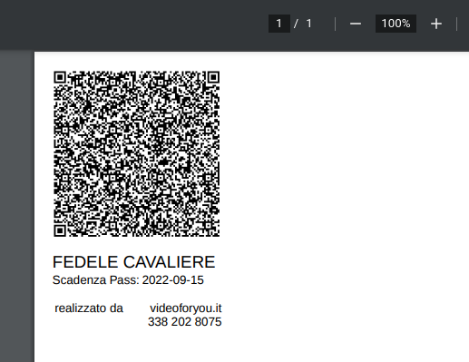

# Green Pass Pocketizer
Gets the QR Code downloaded from the Italian Health Minister platform. 

Then the QR gets decoded to gather, via the official NodeJS APIs, further details of the Certificates owner such as the name and the certification official expiration. 

## Result
Along with these details, the QR is arranged in the final template and ultimately the software generates an A4 page PDF in order to print a 8x5cm pocket card.

## Deployment
Docker is our friend =D

As easy as that
